# T3A2-A • GP Online Appointment Web Application

### Anushke Karunaratna and Bangkai Yu

## Description

The objective of this project is to create an online appointment scheduling application specifically designed for clinic management at a general practitioner center in regional NSW. The app will cater to the needs of doctors and administrative staff, focusing on streamlining appointment scheduling and management processes. With this application, doctors will have the ability to efficiently manage their schedules and access appointment information, enabling them to optimize their time and improve clinic operations. Administrative staff will be empowered to handle appointment bookings, cancellations, and rescheduling effectively, ensuring smooth clinic operations. The application will prioritize data security and privacy to safeguard patient information. By developing this specialized app, the clinic aims to bring convenience, efficiency, and satisfaction to streamline appointment scheduling processes for the staff.

## Purpose

The current web application used by the GP clinic is quite outdated and requires a revamp to revolutionize appointment management and enhance the overall healthcare experience. The goal of the new application is to streamline the scheduling and oversight of medical visits for doctors, leveraging technology to provide a user-friendly platform. This includes the efficient management of appointments, easy access to patient appointment information, and convenient retrieval of patient contact details and past appointments. By achieving these goals, the application aims to increase efficiency, reduce administrative costs, and optimize clinic operations. 

## Target Audience 

The target audience for the web application is doctors (GP's) and clinical administrators working in clinics. Doctors can rely on the app to efficiently manage their appointment schedules, access patient information, and streamline their workflow. Clinical administrators, on the other hand, utilize the app to handle appointment bookings and manage patient flow. By targeting this audience, the website aims to enhance efficiency, improve coordination, and optimize the appointment management process in healthcare settings.

## Functionality / Features

- The web application will allow users to maintain their profiles where they can enter there contact details. Admins will also be able to add/create new users. 

-  Users can view the daily schedule, see upcoming appointments, create, update and delete appointments and be notified of any changes made to appointments. The application will also provide doctors with a clear and organized view of their schedule, allowing them to easily access information about their upcoming appointments. This functionality ensures that doctors are informed and can properly manage their time, lowering the likelihood of scheduling conflicts or missed appointments. 

- The web application ensures that all users, including doctors, have secure access to patient appointment records. This feature is particularly valuable for doctors as it allows them to review previous appointments and gain valuable insights into the patient's healthcare journey. This feature enhances the continuity of care and supports informed decision-making during subsequent appointments

- The web application will provide a real-time status visibility of appointments for efficient appointment management. The status of appointments will be categorized as "on the way," "waiting," "with doctor," or "completed," allowing for easy tracking and monitoring

## Profiles / User Stories

A set of user stories have been created to meet the specific requirements and frustrations of the clinic's healthcare personnel. These user stories try to capture Dr. Tom Brady's, Dr. Kate Lam's, Dr. Rajesh Abeyan's, and Laura Simmons' aspirations and frustrations as they play critical roles in the clinic's operations. The user stories provide insights into the improvements and solutions needed to improve efficiency, optimise workflows, and ultimately deliver great patient care by focusing on their experiences and requirements. Through these user stories, the clinic can gain a deeper understanding of the issues these patients encounter and work towards building solutions that match their specific requirements.

### *Dr. Tom Brady - Profile*

### *Dr. Tom Brady - User Stories*
I require a software system that is intuitive and user-friendly. I want the software to have a well-designed user interface, streamlined navigation, and intuitive features that allow me to easily access patient information, input data, and perform necessary tasks. The current software's lack of intuitiveness and steep learning curve impede my workflow and productivity, resulting in time-consuming tasks and hindrances to providing quality patient care. By having a software system with an intuitive user interface and user-friendly features, I will be able to navigate through the software seamlessly, complete tasks efficiently, and focus more on delivering excellent patient care.

It is crucial for me to receive adequate customer support from the software vendor. I need the assurance that any issues or concerns I encounter will be promptly addressed. Inadequate customer support or a lack of responsiveness amplifies my frustrations and hinders my ability to efficiently resolve problems. By having access to responsive customer support, I can quickly seek assistance when needed, receive timely resolutions to software-related issues, and feel supported in utilizing the software effectively. This would enhance my productivity, reduce downtime, and ensure that software-related frustrations do not hinder my ability to provide quality patient care.

### *Dr. Kate Lam - Profile*

### *Dr. Kate Lam - User Stories*
I rely on the software to be dependable and free from technical issues. I want the software to function reliably, without crashes, slowdowns, or frequent glitches that disrupt my workflow that cause delays in patient care. It is essential that the software performs consistently, allowing me to access patient records, input data, and retrieve information without interruptions or system failures. By having a reliable software system, I can focus on delivering quality care to my patients without unnecessary stress or hindrances.

I need the software systems used in the clinic to be compatible and seamlessly integrate with each other. I want the  electronic health record (EHR) system, scheduling software, and billing system to work together effectively, enabling me to access and synchronize patient information across different platforms. Compatibility issues can lead to data discrepancies, duplication of efforts, and errors in accessing patient records. By having compatible software systems, I can seamlessly navigate through different platforms, retrieve accurate patient information, and provide continuity of care without interruptions or challenges caused by incompatible systems.

### *Dr. Rajesh Abeyan - Profile*

### *Dr. Rajesh Abeyan - User Stories*
I want the software to send me timely reminders about upcoming appointments, ensuring that I can efficiently manage my schedule and provide prompt care to my patients. These reminders should include essential details such as the patient's name, appointment time, and reason for the visit. By receiving these reminders, I can proactively plan my day, allocate appropriate time for each appointment, and avoid any scheduling conflicts or delays. This feature would significantly improve my time management and ensure a smooth and organized clinic workflow.

I require real-time information about my patients' status to optimize my workflow and provide timely care. I want the software to provide me with a clear and easily accessible overview of each patient's status, indicating whether they have checked-in, are currently waiting, or require attention. By having this visibility, I can efficiently prioritize my tasks, prepare for upcoming consultations, and address any urgent or time-sensitive cases promptly. This feature would enhance my ability to deliver efficient and patient-centered care, leading to better patient outcomes and satisfaction.

I need easy access to patient information before their scheduled appointments to provide personalized and effective care. I want the software to allow me to review previous appointments. This accessibility to  patient information would enable me to familiarize myself with their medical history, identify potential concerns or trends, and make informed decisions during the consultation. By having this feature available, I can offer more personalized and efficient care, building stronger doctor-patient relationships and ensuring better continuity of care.

### *Laura Simmons - Profile* 

### *Laura Simmons - User Stories* 
I require a software system that is intuitive and easy to learn, allowing me to efficiently manage various aspects of clinic operations. I want the system to have a user-friendly interface, clear navigation, and intuitive features that enable me to quickly understand and utilize its functionalities. By having an intuitive system, I can easily perform tasks such as managing appointments, updating patient records, generating reports, and coordinating with doctors and staff. This feature would enhance my productivity, reduce training time, and ensure smooth clinic operations.

I need the software to provide me with a seamless and efficient way to manage doctors' schedules. I want the system to allow me to easily add, edit, or reschedule appointments on behalf of the doctors, accommodating any last-minute changes or cancellations. It should provide a clear overview of the doctors' availability, allow me to assign patients to specific doctors, and send notifications to doctors and patients regarding any schedule modifications. This functionality would save me time, streamline the scheduling process, and ensure optimal utilization of doctors' time.

As a clinical administrator, it is crucial for me to have a comprehensive view of all doctors' schedules within the software. I want the system to provide me with an overview that displays each doctor's schedule, including appointments, breaks, and availability. This overview will allow me to assess the clinic's staffing levels, identify any gaps or conflicts in the schedules, and take necessary actions to ensure the clinic is adequately staffed at all times. This feature would enable me to optimize resource allocation, improve clinic efficiency, and provide better patient service.

As a clinical administrator, it is essential for me to have a real-time overview of all patients in the clinic. I want the software to display the current status of each patient, indicating whether they have checked-in, are waiting, or have been called in for their appointment. This real-time status board will allow me to monitor patient flow, identify potential bottlenecks or delays, and take proactive measures to manage patient wait times effectively. By having this information readily available, I can optimize the clinic's operations, ensure a smooth patient experience, and minimize waiting times.

## Tech Stack / Application Achitecture Diagram

The React front-end interacts with the Node Express back-end via HTTP requests and APIs. The backend interfaces with the MongoDB database using Mongoose for data store and retrieval. The application is deployed and hosted on Netlify and Google Cloud Platform, which provides a scalable and dependable hosting environment. The codebase is handled and collaborated on using GitHub, which allows for version control and fast team collaboration.

### *Front-End*
* **React**: The application's front-end is created with React, which enables for the building of interactive and dynamic user interfaces
* **Mui Core 5**: To offer a visually appealing and consistent user experience, Material-UI components will be integrated into the React application
  
### *Back-End*
* **Node Express**: The Node.js runtime and Express framework are used to create the back-end server that handles HTTP requests and controls the application's business logic
* **Mongoose**: Mongoose is an Object Data Modelling (ODM) library that allows you to define MongoDB schemas, models, and queries
  
### *Database Management*
* **MongoDB**: MongoDB is the NoSQL database that the application uses to store and retrieve data. The data models defined by Mongoose in the application interact with the MongoDB database to conduct CRUD (Create, Read, Update, Delete) activities
  
### *Cloud Hosting and Deployment*
* **Netlify**: Netlify hosts and deploys the front-end React application. It provides a straightforward framework for continuous integration and deployment (CI/CD) activities, ensuring that the application is automatically created and delivered to a scalable hosting environment
* **Google Cloud Platform (GCP)**: GCP services can be used to improve the functionality of the application. Google Cloud Storage, for example, can be used for file storage, Cloud Functions for serverless computing, or Firestore for extra database needs.

### *Additional Services and Integrations*

* **GitHub**: The version control system is GitHub, which allows developers to collaborate, track changes, and manage the codebase. It serves as a central repository for team members to contribute code, review changes, and manage branches.

## Wireframes
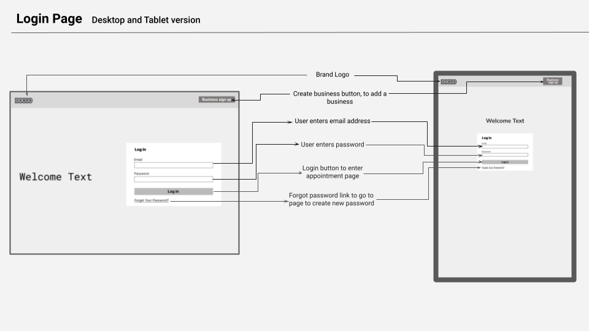

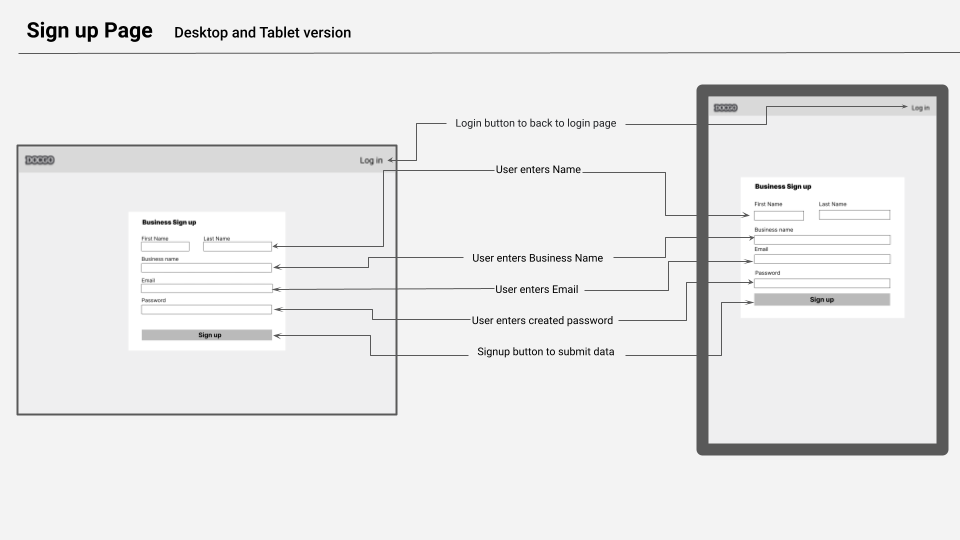

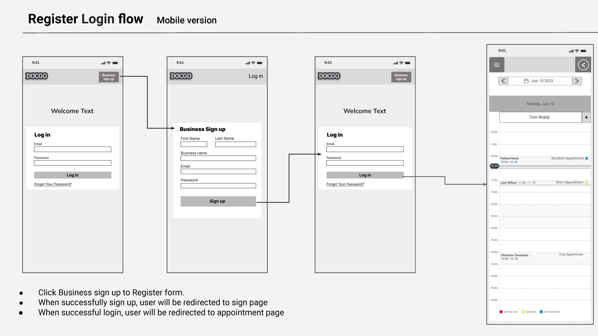

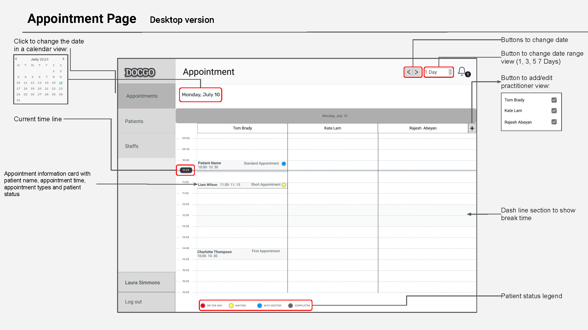

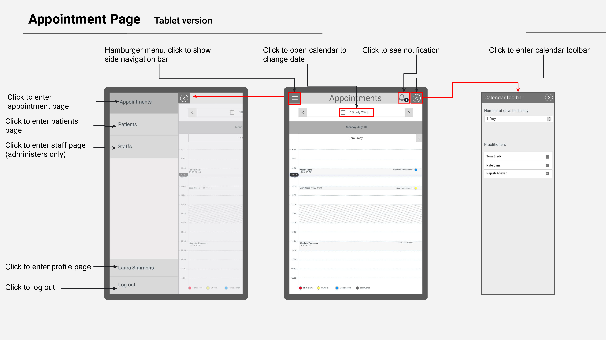

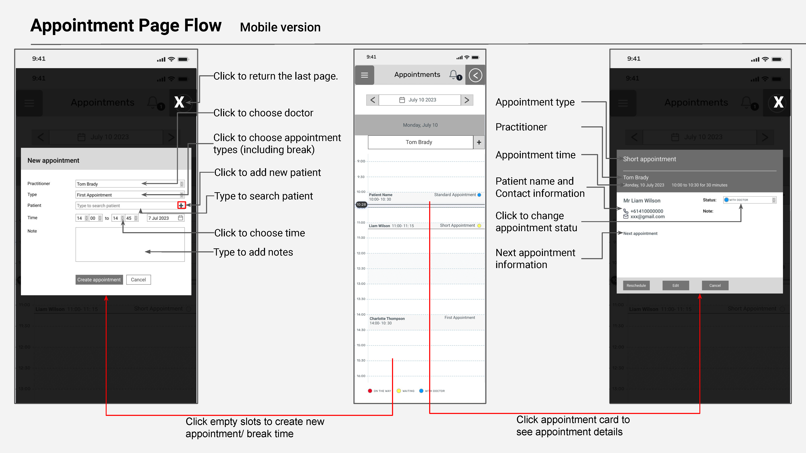

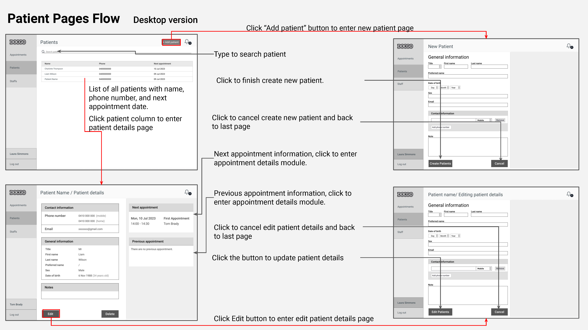

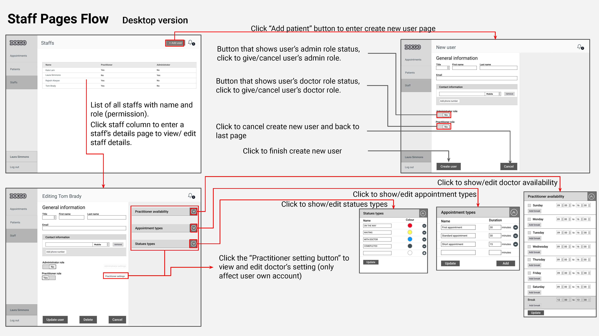

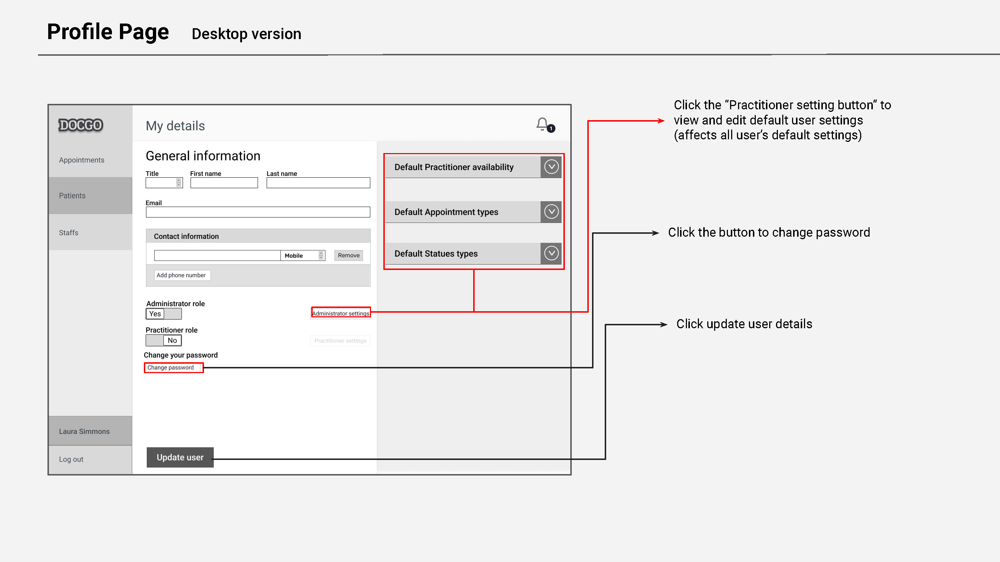

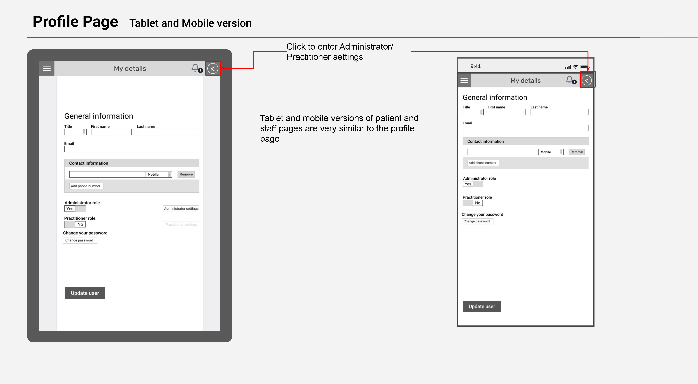

## Dataflow Diagram

The Data Flow Diagram depicts the flow of data and interactions within a system for managing medical appointments and patient and user information. The graphic depicts several components and their interconnections, allowing for a visual picture of how data flows through the systems.

#### *Signup Business*
The diagram includes a signup component that allows a user to create an account for there clinic. This component also collects details such as name, email, business name and password and stores them securely in the system. The data related to user signup flows into this component.

#### *Change Password*
If a user has forgotten there password, they can change there password by entering there user details. They can also change there password when they are logged on. Both components interacts with the user database

#### *Login Process*
The diagram illustrates the login component that verifies user credentials and grants access to authorized users. This component interacts with the user database to validate login credentials and allow users to log into the system.

#### *User Profile*
The diagram includes a component for managing user profiles. This component enables the creation, updating, deletion and storage of user information such as contact name and contact details. The data related to user profiles flows into and out of this component. Admins will also have special privileges to create new user profiles. 

#### *Appointments*
The data flow diagram depicts the flow of data associated with appointments. This provides elements for viewing, creating, updating, and cancelling appointments. Data flows between these components and other system components, such as user profiles and patient information. 

#### *Patients' Information*
The diagram depicts the flow of data connected to patient information. This contains components for storing and accessing patient records, medical histories, and other relevant data. The system communicates with this component to retrieve and update patient information as needed. Patient details can also be deleted. 

## Project Management
We chose Jira for our workflow management system. A link can be found here - https://anushkek.atlassian.net/jira/software/projects/T3A2/boards/1/timeline  

These were steps we followed:
* **Project Initiation**: Define the project's objectives, scope, and desired outcomes. Identify who were the key users, go over the rubric and establish different roles to complete the project. 

* **Requirement Gathering**: We then conduct thorough research and had a meeting with a doctor. We were able to identify their needs, pain points, and desired features for the appointment management web application.

* **Project Planning**: We developed a  project plan that outlined the timeline. We would have a daily standup every morning and set goals to be met within the day. We also considered potential risks and develop contingency plans.

* **Design and Development**: We created wireframes and designed data flow diagrams that reflect the desired user interface and user experience. 

### *Sprints*

* **Sprint 1** - Set up the project environment, including version control, development tools, and communication channels.

* **Sprint 2** - Conduct stakeholder interviews and workshops to gather detailed requirements from doctors, clinical administrators, and other end-users.

* **Sprint 3** - Document user stories, use cases, and functional requirements based on the gathered information.

* **Sprint 4** - Create wireframes  for the website's user interface (UI).

* **Sprint 5** - Create Data Flow Diagram and define tech stack/ architecture 
  
### *Timeline*
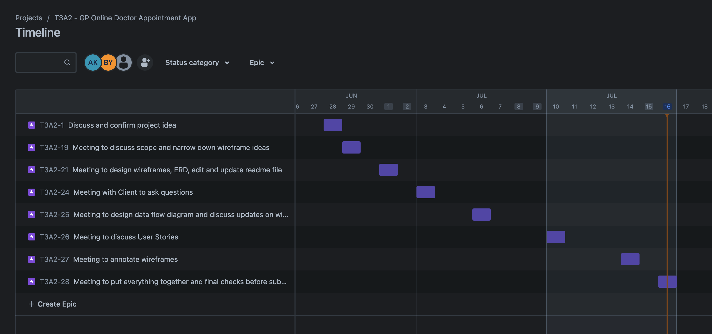

Specific meeting notes can be found in the timeline

Timeline link can be found here  - https://jira.external-share.com/issue/81826/anushke_karunaratna_@_timeline_share

### *Jira Board*

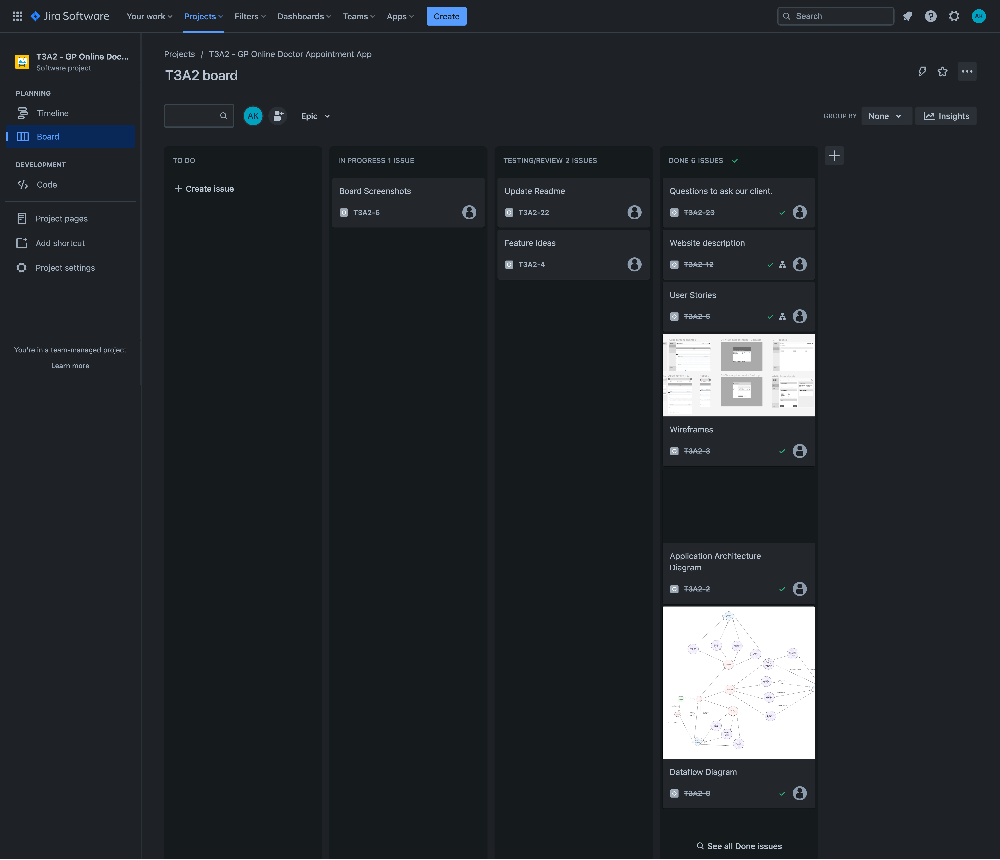

Jira board can be found here  - https://jira.external-share.com/issue/81825/anushke_karunaratna_@_board_share

Github repo can also be found here  - https://github.com/nush16/T3A2-A