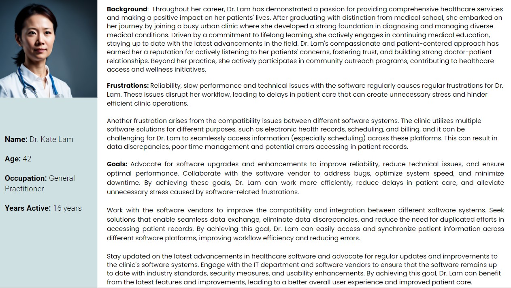

# T3A2-A • GP Online Doctor Appointment App

### Anushke Karunaratna and Bangkai Yu

## Description

The objective of this project is to create an online doctor appointment application for a general practitioner center in regional NSW. The app will cater to the needs of both doctors and administrative staff, boosting efficiency and enhancing the user experience. Doctors can manage schedules, access patient information, and improve patient care. Administrative staff can efficiently manage appointments and clinic operations. The application will prioritize data security and privacy. By creating this comprehensive app, the clinic aims to bring convenience, efficiency, and satisfaction to healthcare providers and patients, embracing technology for optimized healthcare delivery.

## Purpose

 The current application the GP clinic uses is quite outdated, so the goal of is to revolutionise appointment management and improve the overall healthcare experience. The application also seeks to streamline the scheduling and oversight of medical visits for both doctors and patients by leveraging technology and providing a user-friendly platform. The goal is to increase efficiency, lower administrative costs, and optimise clinic operations. This application will allow doctors to properly organise their schedules, retrieve patient information, and provide personalised care. Finally, the goal of this software is to provide a seamless, efficient, and patient-centered healthcare experience, revolutionising how appointments are scheduled and handled in the digital era.

## Functionality / Features

### *Doctor User*

- The application will allow doctors to create and maintain their professional profiles. They can input their relevant information, including qualifications, areas of expertise, and contact details. 

-  Doctors can view their schedule, see upcoming appointments, and be notified of any changes made by patients: The application will provide doctors with a clear and organized view of their schedule, allowing them to easily access information about their upcoming appointments. They will be notified in real-time of any changes made by patients, such as appointment bookings, cancellations, or rescheduling. This functionality ensures that doctors are informed and can properly manage their time, lowering the likelihood of scheduling conflicts or missed appointments.

- Doctors will have secure access to a patient's medical records. This feature allows doctors to review relevant medical history, diagnoses, and treatment plans, providing them with valuable insights into the patient's healthcare journey. Access to comprehensive and up-to-date medical records enhances the accuracy of diagnoses and treatment decisions, ultimately improving patient care and outcomes.

### *Clinical Administrative Staff*

- Clinical Administrators can doctor profiles, including creation, deletion, or modifications. They can create new profiles, update existing ones, and handle any necessary modifications. This feature ensures that the system's user data remains accurate, up-to-date, and aligned with the clinic's requirements.

- Clinical Administrators may manage all appointments, assist with scheduling, and handle cancellations or rescheduling: The programme allows administrators to manage all appointments within the system. They can see the whole appointment schedule, help with new appointment scheduling, and handle any cancellations or rescheduling requests from patients or doctors. This feature simplifies the appointment management process, allowing administrators to optimise resource allocation and maintain a smooth flow of patients through the clinic.

- Clinical Administrators will receive notifications about new appointment bookings, cancellations, rescheduling requests, and other important events. By getting these notifications, administrators may keep informed and take appropriate action, guaranteeing efficient clinic operations and providing great service to both doctors and patients.

## Target Audience

---

## User Stories

A set of user stories have been created to meet the specific requirements and frustrations of the clinic's healthcare personnel. These user stories try to capture Dr. Tom Brady's, Dr. Kate Lam's, Dr. Rajesh Abeyan's, and Laura Simmons' aspirations and frustrations as they play critical roles in the clinic's operations. The user stories provide insights into the improvements and solutions needed to improve efficiency, optimise workflows, and ultimately deliver great patient care by focusing on their experiences and requirements. Through these user stories, the clinic can gain a deeper understanding of the issues these patients encounter and work towards building solutions that match their specific requirements.

### *Dr. Tom Brady*

I require a software system that is intuitive and user-friendly. I want the software to have a well-designed user interface, streamlined navigation, and intuitive features that allow me to easily access patient information, input data, and perform necessary tasks. The current software's lack of intuitiveness and steep learning curve impede my workflow and productivity, resulting in time-consuming tasks and hindrances to providing quality patient care. By having a software system with an intuitive user interface and user-friendly features, I will be able to navigate through the software seamlessly, complete tasks efficiently, and focus more on delivering excellent patient care.

It is crucial for me to receive adequate customer support from the software vendor. I need the assurance that any issues or concerns I encounter will be promptly addressed. Inadequate customer support or a lack of responsiveness amplifies my frustrations and hinders my ability to efficiently resolve problems. By having access to responsive customer support, I can quickly seek assistance when needed, receive timely resolutions to software-related issues, and feel supported in utilizing the software effectively. This would enhance my productivity, reduce downtime, and ensure that software-related frustrations do not hinder my ability to provide quality patient care.

### *Dr. Kate Lam*

I rely on the software to be dependable and free from technical issues. I want the software to function reliably, without crashes, slowdowns, or frequent glitches that disrupt my workflow that cause delays in patient care. It is essential that the software performs consistently, allowing me to access patient records, input data, and retrieve information without interruptions or system failures. By having a reliable software system, I can focus on delivering quality care to my patients without unnecessary stress or hindrances.

I need the software systems used in the clinic to be compatible and seamlessly integrate with each other. I want the electronic health record (EHR) system, scheduling software, and billing system to work together effectively, enabling me to access and synchronize patient information across different platforms. Compatibility issues can lead to data discrepancies, duplication of efforts, and errors in accessing patient records. By having compatible software systems, I can seamlessly navigate through different platforms, retrieve accurate patient information, and provide continuity of care without interruptions or challenges caused by incompatible systems.

### *Dr. Rajesh Abeyan*

I want the software to send me timely reminders about upcoming appointments, ensuring that I can efficiently manage my schedule and provide prompt care to my patients. These reminders should include essential details such as the patient's name, appointment time, and reason for the visit. By receiving these reminders, I can proactively plan my day, allocate appropriate time for each appointment, and avoid any scheduling conflicts or delays. This feature would significantly improve my time management and ensure a smooth and organized clinic workflow.

I require real-time information about my patients' status to optimize my workflow and provide timely care. I want the software to provide me with a clear and easily accessible overview of each patient's status, indicating whether they have checked-in, are currently waiting, or require attention. By having this visibility, I can efficiently prioritize my tasks, prepare for upcoming consultations, and address any urgent or time-sensitive cases promptly. This feature would enhance my ability to deliver efficient and patient-centered care, leading to better patient outcomes and satisfaction.

I need easy access to patient information before their scheduled appointments to provide personalized and effective care. I want the software to allow me to review relevant medical records, including past diagnoses, treatment plans, medications, and any recent test results. This accessibility to comprehensive patient information would enable me to familiarize myself with their medical history, identify potential concerns or trends, and make informed decisions during the consultation. By having this feature available, I can offer more personalized and efficient care, building stronger doctor-patient relationships and ensuring better continuity of care.

### *Laura Simmons* 

I require a software system that is intuitive and easy to learn, allowing me to efficiently manage various aspects of clinic operations. I want the system to have a user-friendly interface, clear navigation, and intuitive features that enable me to quickly understand and utilize its functionalities. By having an intuitive system, I can easily perform tasks such as managing appointments, updating patient records, generating reports, and coordinating with doctors and staff. This feature would enhance my productivity, reduce training time, and ensure smooth clinic operations.

I need the software to provide me with a seamless and efficient way to manage doctors' schedules. I want the system to allow me to easily add, edit, or reschedule appointments on behalf of the doctors, accommodating any last-minute changes or cancellations. It should provide a clear overview of the doctors' availability, allow me to assign patients to specific doctors, and send notifications to doctors and patients regarding any schedule modifications. This functionality would save me time, streamline the scheduling process, and ensure optimal utilization of doctors' time.

As a clinical administrator, it is crucial for me to have a comprehensive view of all doctors' schedules within the software. I want the system to provide me with an overview that displays each doctor's schedule, including appointments, breaks, and availability. This overview will allow me to assess the clinic's staffing levels, identify any gaps or conflicts in the schedules, and take necessary actions to ensure the clinic is adequately staffed at all times. This feature would enable me to optimize resource allocation, improve clinic efficiency, and provide better patient service.

As a clinical administrator, it is essential for me to have a real-time overview of all patients in the clinic. I want the software to display the current status of each patient, indicating whether they have checked-in, are waiting, or have been called in for their appointment. This real-time status board will allow me to monitor patient flow, identify potential bottlenecks or delays, and take proactive measures to manage patient wait times effectively. By having this information readily available, I can optimize the clinic's operations, ensure a smooth patient experience, and minimize waiting times.

## Tech Stack / Application Achitecture Diagram

The React front-end interacts with the Node Express back-end via HTTP requests and APIs. The backend interfaces with the MongoDB database using Mongoose for data store and retrieval. The application is deployed and hosted on Netlify and Google Cloud Platform, which provides a scalable and dependable hosting environment. The codebase is handled and collaborated on using GitHub, which allows for version control and fast team collaboration.

### *Front-End*
* **React**: The application's front-end is created with React, which enables for the building of interactive and dynamic user interfaces
* **Mui Core 5**: To offer a visually appealing and consistent user experience, Material-UI components will be integrated into the React application
  
### *Back-End*
* **Node Express**: The Node.js runtime and Express framework are used to create the back-end server that handles HTTP requests and controls the application's business logic
* **Mongoose**: Mongoose is an Object Data Modelling (ODM) library that allows you to define MongoDB schemas, models, and queries
  
### *Database Management*
* **MongoDB**: MongoDB is the NoSQL database that the application uses to store and retrieve data. The data models defined by Mongoose in the application interact with the MongoDB database to conduct CRUD (Create, Read, Update, Delete) activities
  
### *Cloud Hosting and Deployment*
* **Netlify**: Netlify hosts and deploys the front-end React application. It provides a straightforward framework for continuous integration and deployment (CI/CD) activities, ensuring that the application is automatically created and delivered to a scalable hosting environment
* **Google Cloud Platform (GCP)**: GCP services can be used to improve the functionality of the application. Google Cloud Storage, for example, can be used for file storage, Cloud Functions for serverless computing, or Firestore for extra database needs.

### *Additional Services and Integrations*

* **GitHub**: The version control system is GitHub, which allows developers to collaborate, track changes, and manage the codebase. It serves as a central repository for team members to contribute code, review changes, and manage branches.

## Wireframes

## Dataflow Diagram

Within the doctor appointment app, the data flow diagram showcases how data flows from patients to doctors and clinical administrative staff, including the creation and management of user profiles, appointment scheduling, and access to medical records. 

### *Doctors*

This Data Flow Diagram depicts the flow of data and interactions within a system for managing medical appointments and patient information for a Doctor. The graphic depicts several components and their interconnections, allowing for a visual picture of how data flows through the system.

#### *Login Process*
The diagram illustrates the login component that verifies user credentials and grants access to authorized users. This component interacts with the user account database to validate login credentials and allow users to log into the system.

#### *Doctors Profile*
The diagram includes a component for managing doctors' profiles. This component enables the creation, updating, and storage of doctors' information such as qualifications, areas of expertise, and contact details. The data related to doctors' profiles flows into and out of this component.

#### *Appointments*
The data flow diagram depicts the flow of data associated with appointments. This provides elements for creating, changing, and cancelling appointments. Data flows between these components and other system components, such as doctor profiles and patient information.

#### *Patients' Information*
The diagram depicts the flow of data connected to patient information. This contains components for storing and accessing patient records, medical histories, and other relevant data. The system communicates with this component to retrieve and update patient information as needed.

### Clinical Administrator

This Data Flow Diagram depicts the flow of data and interactions within a system for managing medical appointments and patient information for a clinical Administrator. The graphic depicts several components and their interconnections, allowing for a visual picture of how data flows through the system.

#### *Signup*
The diagram includes a signup component that allows new users to create an account. This component collects user details such as name, email, and password and stores them securely in the system. The data related to user signup flows into this component.

#### *Login Process*
The diagram illustrates the login component that verifies user credentials and grants access to authorized users. This component interacts with the user account database to validate login credentials and allow users to log into the system.

#### *Doctors Profile*
The diagram includes a component for managing doctors' profiles. This component enables the creation, updating, deletion and storage of doctors' information such as qualifications, areas of expertise, and contact details. The data related to doctors' profiles flows into and out of this component.

#### *Appointments*
The data flow diagram depicts the flow of data associated with appointments. This provides elements for creating, changing, and cancelling appointments. Data flows between these components and other system components, such as doctor profiles and patient information.

#### *Patients' Information*
The diagram depicts the flow of data connected to patient information. This contains components for storing and accessing patient records, medical histories, and other relevant data. The system communicates with this component to retrieve and update patient information as needed.

## Project Management

We chose Jira for our workflow management system. A link can be found here 

https://anushkek.atlassian.net/jira/software/projects/T3A2/boards/1/timeline